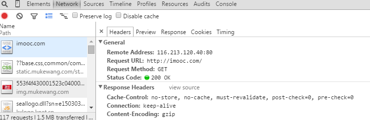
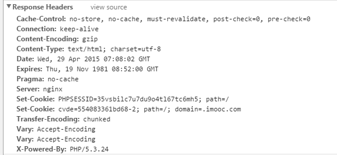
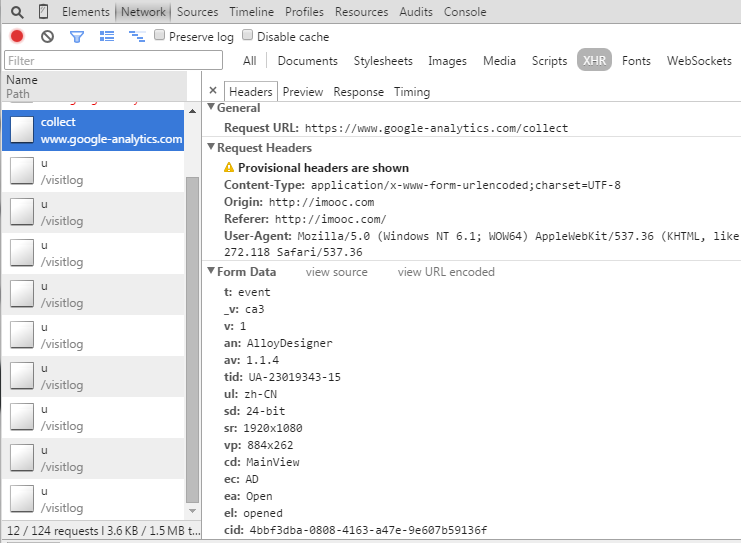
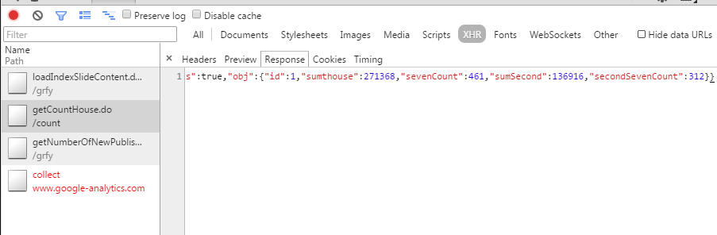
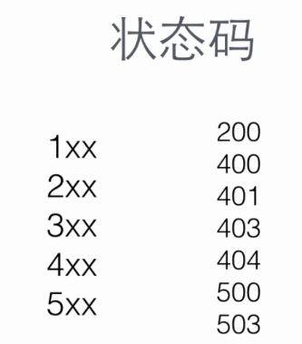

title: HTTP相关知识
date: 2015-11-25 17:42:19
tags:HTTP
categories:HTTP
---
### 相关知识
http 就是一种协议,计算机之间要共同遵守这个协议的规则才能相互通信

通常由http 客户端发起一个请求比如用手机上的浏览器打开一个网站，就会创建一个到
服务器指定端口的TCP链接 http服务器就在那个端口监听客户端的请求，一旦受到请求，服务器就会向
客户端返回一个状态.(比如200的状态码，同时返回内容，比如请求的文件,错误信息,json数据等)

域名解析,浏览器先搜索自身的DNS缓存,看有没有过期——如果缓存中没找到,那么浏览器会搜索系统自身的DNS缓存
——如果操作系统中也没找到 就会尝试读取计算机本地的host文件——如果还没找到对应的配置项那么浏览器就会发起一个DNS系统调用就会向本地主库DNS服务器（一般是宽带运营商提供的）发起一个域名解析请求-运营商DNS服务器首先会查找自身的缓存——如果还没找到，运营商的服务器会代替我们的浏览器发起一个迭代的DNS请求（最后一层一层拿到 域名的ip地址后 返回给操作系统同时缓存.系统内核拿到ip地址后返回给浏览器并且缓存）(理论上域名解析的过程是很复杂的)——拿到ip地址后发起经典的TCP三次握手浏览器就会以一个随机端口向服务器的web程序（比如nginx  apache）80端口发起一个TCP的链接请求这个链接请求通过层层的路由设备到达服务器端以后进入到网卡 完后进入到内核的TCP/IP协议带还有可能会经过防火墙的过滤，最终到了web服务端，完后就建立起了 TCP/IP的链接，TCP/IP链接建立起来以后,浏览器就可以向服务器发送http请求了（比如使用HTTP的GET方法请求根域的一个域名，可以采用http1.0的一个协议）——请求发送以后服务器端接收到了这个请求-然后根据后端一些处理以后把处理后结果的一个数据返回给浏览器（比如请求的是一个html页面,这时候就是把完整的html代码返回给浏览器）——浏览器拿到html页面代码在解析和渲染这个页面的时候里面的js,css图片等静态资源他们也同样是一个个的http请求（都需要经过上面的一个个步骤）——最终把一个完整的页面呈现给用户
（可以拆分成请求和响应，无论请求或响应会发送http头和正文信息）
chrome 浏览器 - Network

Remote Address  - 远端服务器的ip地址
Request URL -请求地址
Request Method - 请求方法
Status Code - 状态码

Response Headers  响应头

点击XHR 筛选 出来的都是ajax 请求 
Form Data  - 表单数据，请求的时候发送给服务器端的内容

XHR  response 可以 看到Ajax 的响应内容
--------
HTTP1.1协议 里面 一共定义了8种请求方法 以不同方式来操作指定资源
 * GET
 * POST
 * PUT
 * DELETE
 * HEAD
 * TRACE
 * OPTIONS
 

GET  - 从url地址输入以后 拿到html页面的都是get方式 一般用来获取或读取数据
POST - 向指定的资源去提交数据,比如要新建用户或者上传视频创建资源，都通过post方式来提交、
PUT - 更新 向指定资源的位置上上传一个最新的内容 比如更新用户头像或者替换视频
DELETE - 删除 请求服务器来删除指定资源
HEAD - 跟 get 差不多  但是不用传输全部内容就可以获得原信息
TRACE
OPTIONS

状态码就是服务器返回给浏览器的时候 告诉浏览器当前成功或者失败的一个响应状态
1XX 表示 请求已经接收 继续处理
2xx  成功，处理掉了
3XX 重定向
4XX 客户端错误
5XX 服务端错误

200 请求成功 400客户端请求语法错误  401请求没有经过授权  403服务端收到请求但是拒绝提供服务 404 没找到 请求资源不存在 
500 服务端发生不可预期的错误 503服务器端当前还不能处理 请求

