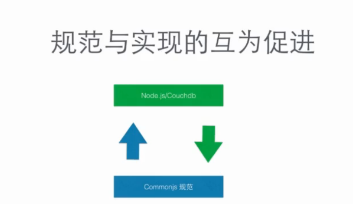

title: Node.js模块与Commonjs规范
date: 2015-11-23 16:38:55
tags: Node.js
categories: Node.js
---
### Node.js模块与Commonjs规范
====================

JavaScript 天生缺少模块管理机制，来隔离实现不同功能的js判断，避免他们相互污染，为此我们经常采用匿名空间的方式把变量和函数限制在某个特定的作用域内，约定一套命名规范来约束代码，从而保证代码的安全执行。

比如JQuery里面 其实有许多的变量和方法，但是你直接是访问不到的必须通过jquery或$符号来调用里面的方法。
Commonjs 并不像JQuery那样一个具体负责某个职能的js库，他是一套规范包括了模块,包,系统二进制等单元测试来约定javascript来怎么去组织和编写同时大部分标准都在拟定和讨论之中的。首先是把这些执行不同任务特定的代码块或者代码文件，看作是一个独立的模块，每个模块可以看作是一个独立的作用域，但并不是孤立的，可能存在依赖关系，对于一个模块可以分成三个关键部分，分别是模块的定义，标识，和引用。

node.js对 commonjs规范的实现 又反过来印证并且反馈给社区来促成进一步的优化。
node.js借鉴commonjs模块组织的理念，并基于commonjs，实现了模块管理系统.
在node.js里面 每个js文件可以看作是一个独立的模块在他里面不需要有命名空间不用担心变量污染和方法定义时候的隔离，整个文件中的代码可以非常自然的组织起来同时这些独立的模块，通过彼此的依赖和引入可以组合起来形成一个更强大完整的模块或者说是功能包.
我们安装node.js的时候会同时安装 npm 管理工具 通过这个npm可以往项目里面引入各种模块，他们每个都是独立完整的。
